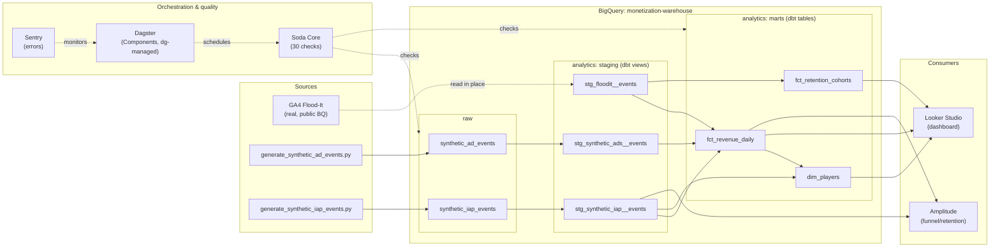

# game-monetization-platform

End-to-end F2P monetization analytics on real GA4 data — BigQuery, dbt, Dagster, Soda, Looker Studio.

A production-shaped data platform built around a working free-to-play puzzle game (Google's public GA4 Flood-It! sample) with calibrated synthetic ad-mediation and IAP layers filling the schema gaps that real public datasets don't cover. The goal is to demonstrate the full monetization analyst toolkit — canonical metric definitions, dbt models, data quality at three layers, scheduled orchestration, BI dashboards, product analytics — against a realistic data shape, with every architectural choice captured in a versioned ADR. Every piece of infrastructure is the same one a real game studio would use; the data is real where public, transparently synthetic where it isn't ([ADR-0013](docs/adr/0013-data-acquisition.md)).

## Live dashboard

**[Flood-It! Monetization Dashboard →](https://datastudio.google.com/reporting/dca0554f-5906-4c2d-8576-e5c4f922c3cb)**

ARPDAU, D0–D30 retention curve with industry benchmark lines, paying conversion rate, cohort revenue, payer-segment breakdown, total revenue. Six tiles, all reading from the dbt marts.

## Architecture

Real Flood-It events are read in place from `firebase-public-project` (no copy, no storage cost). Synthetic generators write Parquet to `raw.synthetic_*`; dbt views stage everything; three mart tables (`fct_revenue_daily`, `dim_players`, `fct_retention_cohorts`) serve the dashboard and Amplitude. Dagster schedules Soda's 30 quality checks daily. Three glossary metrics' source of truth is `dim_players`; two come from `fct_revenue_daily`; one from `fct_retention_cohorts`.

## Stack

| Layer | Tool |
|-------|------|
| Warehouse | Google BigQuery (free tier) |
| Transformation | dbt-bigquery (staging / intermediate / marts per [ADR-0012](docs/adr/0012-dbt-project-structure.md)) |
| Orchestration | Dagster (Components-based, dg-managed) |
| Data quality | dbt tests + Soda Core + Dagster sensors (three-layer split per [ADR-0005](docs/adr/0005-data-quality-tool.md)) |
| BI | Looker Studio |
| Product analytics | Amplitude |
| Observability | Sentry |

## Analyses

Three writeups demonstrating analytical thinking against the warehouse:

1. [Retention curve health and D7 improvement priorities](docs/analyses/01-retention-curve-and-d7-improvements.md) — leaky front door, sticky back door
2. [Revenue concentration and live-ops priorities](docs/analyses/02-revenue-concentration-and-live-ops-priorities.md) — top 1% of users drive 86% of revenue
3. [Starter pack price-test design](docs/analyses/03-starter-pack-price-test-design.md) — sample-size math at 0.40% baseline conversion

## Documentation

- **[docs/glossary.md](docs/glossary.md)** — canonical metric definitions (ARPDAU, ARPPU, LTV, D1/D7/D30 retention, conversion rate, whale concentration), each pointing at its source-of-truth dbt mart
- **[docs/adr/](docs/adr/)** — 13 architecture decision records covering every constraining choice
- **[docs/SETUP.md](docs/SETUP.md)** — the executable build runbook
- **[docs/CAREER.md](docs/CAREER.md)** — parallel job-search track
- **[docs/WORKFLOW.md](docs/WORKFLOW.md)** — human/agent collaboration loop

## Status

End-to-end pipeline live: BigQuery datasets, three staging models, three marts, 30 Soda checks scheduled in Dagster (cron `0 6 * * *`), Looker Studio dashboard published, 500 events ingested into Amplitude for funnel/retention demos. Six canonical metrics encoded with glossary entries; data quality validated at three layers (dbt tests + Soda + Dagster). See `docs/SETUP.md` for the per-step state.
